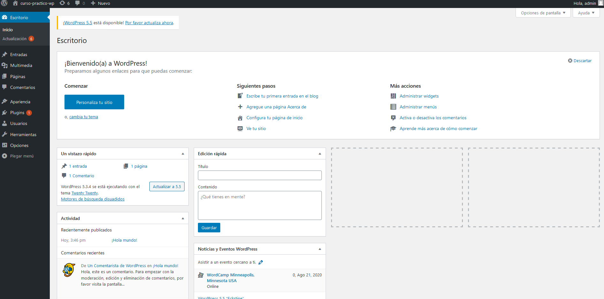
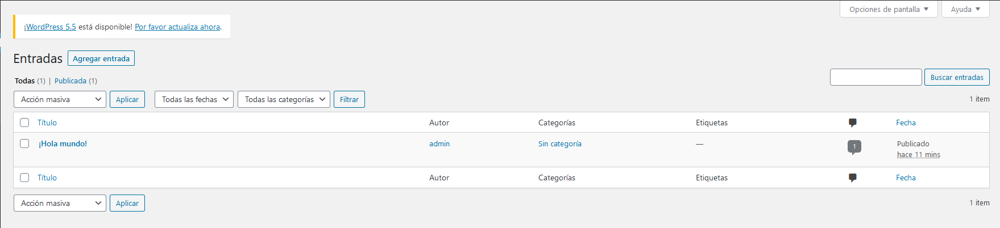
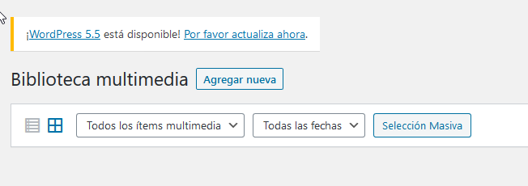
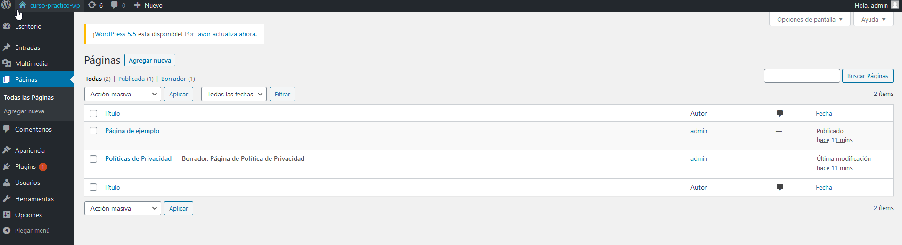
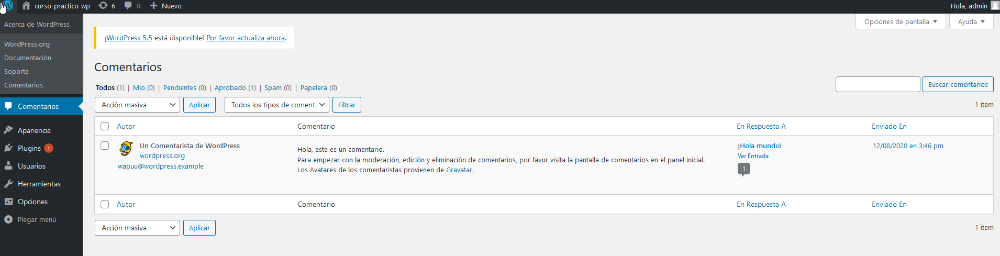
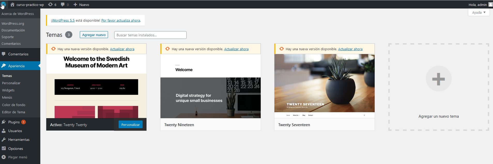
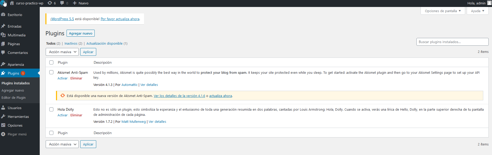
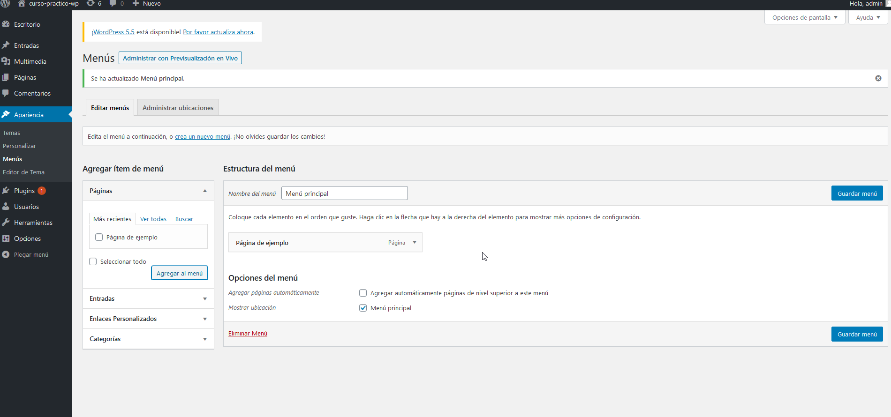
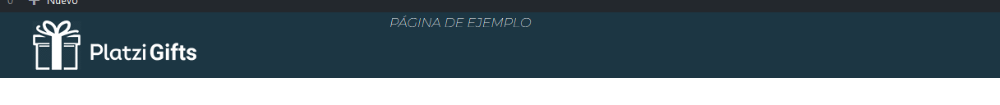

# Curso practico de Wordpress 

# 1. ¿Qué es Wordpress?
Es un sistema de gestión **CMS** (Content Management System). Desarrollado en **PHP** y adaptado para funcionar en entornos que utilizan los sistemas de gestión de bases de datos **MySql**. El mismo opera bajo **licencia GPL** y es de software libre.

## Inicios
Wordpress fue creado el 2003 por el programador estadounidense **Matt Mullenweg**, basándose en otra herramienta de software libre llamada **b2/cafelog**

## Wordpress.com vs Wordpress.org
Wordpress.com es un servicio online, en el no es necesario descargar nada, simplemente te registrar y podras crear un blog o web en sus servidores.
Wordpress.org aqui podemos descargar los archivos fuentes de **wordpress**, y instalarlo en nuestro servidor o entorno local.

# 2. Funcionamiento de wordpress.
WP funciona de la siguiente manera:
- Cúando alguien entra a nuestro sitio, wordpress ejecuta su código fuente.
- El código consulta a la base de datos que contenidos debe devolver y los procesa con los temas o template.
- Estos temas van a ocupar archivos para generar unas vistas.
- A la par, se van a ejecutar losp lugins.

## Principales caracteristicas.
- Autoadministrable: Permite administrar contenido y configuraciones sin usar código.
- Gestión de usuários: Permite crear usuários y segmentarlos por roles.
- API Rest: Permite generar operaciones mediante API rest.
- Flexible: Permite personalizar tanto su dieseño como sus funcionalidades.
- Actualizaciones: Está en constante crecimiento.
- Comunidad: Cuenta con una gran comunidad que aporta a su desarrollo.

# 3. ¿Qué son los temas en Wordpress?
## Theme
Son la estructura de archivos la cual va a generar las vistas en nuestro navegador. Estos archivos toman la información de la base de datos **MySql** y genera el código **HTML** que envía al navegador.

### Archivos Obligatorios de un theme

1. **index.php**: Archivo principal de nuestro theme y página de inicio. Todas las vistas que nosotros generemos van a tomar por defecto nuestro archivo index.php
2. **style.css**: Archivo principal de estilos y parametros de la plantilla.

### Otros archivos que vamos a utilizar 
1. **front-page.php**: Es la vista de carga por defecto, de la página principal.
2. **footer.php**: En este archivo indicaremos la información del pie de página.
3. **functions.php**: Es el archivo central de todas las funcionalidades de nuestro theme, basicamente amplia las funcionalidades del código fuente.
4. **header.php**: En este archivo se indica la información del encabezado.
5. **404.php**: En este archivo se indica la información que se mostrará cuando alguien ingrese a una URL de nuestro sitio que no exista.
6. **page.php**: Es la vista que carga por defecto páginas (vistas), cuando no se especifica una.
7. **screenshot.png**: Este archivo será nuestra imagen de muestra, en la seleccion de theme en el administrador.
8. **single.php**: Es la vista que carga por defecto entradas, post , etc, cuando no se especifica una.

# 4. ¿Qué son los Hooks en Wordpress?
Son lugares dentro del código funete de WP en los cuales podemos agregar código propio o modificar datos que el mismo nos provee.
## Tipos de Hooks
1. **Action**: Nos permite ejecutar una función personalizada en un punto específico del código fuente de WP. funciona de la siguiente forma:
    - funciona con una funcion llamada **add_action** el cual va hacer referencia en algún lugar del código fuente de wordpress que va a estar marcado por un **do_action** y la va a ejecutar justo en ese lugar.
    
    ```php
    <?php 
    
    function holaMundo(){
        echo 'HOLA MUNDO';
    }

    add_action( 'wp_head', 'holaMundo' );
    // add_action( $hook, $functionName );
    ?>
    ```
2. **Filter**: Nos permiten ejectuar una función personalizada en un determinado punto, pero la función que usemos tendrá un parámetro de entrada, dentro de nuestra función heramos modificaciones al parámetro y finalmente lo retornaremos modificado. 
    - ejemplo: 
    ```php
    <?php 
    function upperTitle( $title ) return strtoupper( $title );
    add_filter('the_title', 'upperTitle')
    ?>
    ```

# 5. Manejo de librerías en Wordpress
Para cada tipo de archivos, vamos a ocupar una funcion diferente.
## Archivos CSS
Con los archivos CSS  vamos a ocupar dos funciones:
- **wp_register_style()**: Esta función nos van a servir para tener un registro de las dependencias css que tengamos, pero no las va a ejecutar en nuestro HTML, esta funcion recive 5 argumentos:
    - **$handle (string)**: puede tener el nombre que nosotros querramos.
    - **$src (string | bool)**.
    - **$deps (array())**.
    - **$version (string | bool | null)**.
    - **$media (string)**.
- **wp_enqueue_style()**: Nos va a ejecutar directamente la librería que nosotros le digamos, pero va a llamar las refencias sin necesitar alguna que tengamos registradas. esta funcion recive 5 argumentos:
    - **$handle (string)**: puede tener el nombre que nosotros querramos.
    - **$src (string | bool)**.
    - **$deps (array())**.
    - **$version (string | bool | null)**.
    - **$media (string)**.
Con los archivos JS, vamos a ocupar dos funciones:
- **wp_register_script()**: la funcionalidad y los argumentos son similares al **wp_register_style**, va a cambiar un argumento llamado $in_footer:
    - **$handle (string)**: puede tener el nombre que nosotros querramos.
    - **$src (string | bool)**.
    - **$deps (array())**.
    - **$version (string | bool | null)**.
    - **$in_footer (bool)**
- **wp_enqueue_script()**:
    - **$handle (string)**: puede tener el nombre que nosotros querramos.
    - **$src (string | bool)**.
    - **$deps (array())**.
    - **$version (string | bool | null)**.
    - **$in_footer (bool)**

# 6. Recorrido por el administrador.
El administrador es la parte más fuerte de Wordpress. es una interfaz gráfica desde la cual se pueden administrar todos los contenidos del sitio, esto incluye: entradas de blog, comentarios, imágenes, videos, plugins etc.
Las principales secciones del administrador son las siguientes:
- **Escritorio**: Sugerencia de flujo de trabajo, muestra de la actividad en entradas (textos de blog) y sus comentarios y un borrador rápido donde es posible dejarnos notas para leer en el futuro. 
- **Entradas**: Notas de blog, en caso de que tengamos una página de novedades, se pueden añadir nuevas, eliminar entradas, gestionar categorías y etiquetas. 
- **Medios**: Aquí se van a encontrar todas las imágenes, videos y auidios que subamos. 
- **Páginas**: Secciones de nuestro sitio por las cuales vamos a navegar. 
- **Comentarios**: Se pueden administrar los comentarios en caso de que tengamos entradas de blogs: bloquear usuarios que hagan ciertos comentarios, aprobarlos, o mandar los comentarios a spam. 
- **Apariencia**: Aquí se puede gestionar todo lo referente a nuestros temas. Seleccionar el que deseemos, realizar modificaciones de las secciones que componen los temas (colores y otras opciones), crear los menús de navegación, y editar el código del tema sin tener que entrar directamente al archivo. 
- **Plugins**: Se administran los plugins que tendrá nuestro sitio. Uno instalado por defecto es el de control de spam en los comentarios. El editor de plugins nos permite editar el código de estos sin necesidad de salir del administrador. 

# 7. Importancia roles de usuario
Los roles te permitirán gestionar los permisos de los usuarios dentro de tu sitio, es decir, qué puede y qué no puede hacer dentro del administrador. Estas acciones se denominan capabilities.

Esto es muy útil ya te permite segmentar las tareas de tus usuarios. Por ejemplo, si dentro de la web tienes a alguien cuya tarea es la de crear y corregir notas de blog, si le asignas el rol Editor a su usuario, este no va a poder agregar plugins ni modificar el contenido de las páginas, solo podrá crear y editar notas. Esta práctica es muy importante para garantizar la seguridad y la estructura de nuestro sitio.

Se pueden presentar casos en los que los roles por defecto no alcancen o sean demasiado restrictivos, para eso WordPress brinda la posibilidad de crear, eliminar y modificar roles.

## Crear un rol de usuario.
Para crear un rol de usuario puedes utilizar la función __add_role()__ que nos provee WordPress, la tienes que utilizar dentro de una función y asignarla al hook init. Esto tiene que hacerse desde el archivo __functions.php__.
```php
function add_administrador_tema_role() { //nombre de nuestra función, puede ser el nombre que quieras
    add_role(
        'administrador_tema', //Nombre de role.
        'Administrador Tema', //Nombre que se visualará en la creación o página de opciones de usuarios.
       array(    
            'read' => true, //Permite el acceso al dashboard del adminitrador.
            'switch_themes' => true, //Permite el cambio de temas.
            'edit_themes'   => true, //Permite editar archivos desde el administrado de archivos del tema.
            'edit_theme_options' => true, //Permite modificar Widgets,Menús, Personalizar.
            'install_themes'    => true,  //Permite instalar temas nuevos.
            'update_themes' => true, //Permite actualizar temas instalados.
            'delete_themes' => true, //Permite eliminar temas.

            )   //Array con las capabilities
    );
}

//add_action(Hook, Nombre de la función)
add_action('init', 'add_administrador_tema_role'); 
```

Una vez que este código esté inicializado, el usuario ya quedará creado con esa configuración. Si necesitás eliminarlo, no bastará con eliminar la función, tendrás que usar el método que veremos a continuación.

## Eliminar un rol de usuario
Para eliminar un rol de usuario puedes a utilizar la función __remove_role()__ y, de la misma forma que para crearlo, tienes que utilizarla dentro de una función asignada al hook init, en el archivo __function.php__.
```php
function remove_role_administrado_temas() { //Nombre de la función
    remove_role( 'administrador_tema' ); 
}
 
//add_action(Hook, Nombre de la función)
add_action( 'init', 'remove_role_administrado_temas' );
```

## Modificando roles

Para agregar capabilities en un role, lo primero que tienes que hacer es instanciar el role dentro de una variable conla función get_role(). Una vez hecho eso puedes utilizar los métodos add_cap() y remove_cap().
En el siguiente ejemplo se le dará al role de usuario subscriptor el permiso para editar posts (entradas de blog, custom post type).

```php
function add_cap_subscriber(){ //Nombre de la función
    $role = get_role( 'subscriber' ); //Instaciamos el role en la variable $role
    $role->add_cap( 'edit_posts'); //Agregamos la cabability usando el método add_cap().
}

//add_action(Hook, Nombre de la función)
add_action( 'init', 'add_cap_subscriber');
```

En el siguiente ejemplo se removerá al role de usuario editor, el permiso para modificar contenidos (entradas de blog, custom post type, etc).

```php
function remove_cap_editor(){ //Nombre de la función
    $role = get_role( 'editor' ); //Instaciamos el role en la variable $role
    $role->remove_cap('edit_pages'); //Removemos la cabability usando el método remove_cap().
}

//add_action(Hook, Nombre de la función)
add_action( 'init', 'remove_cap_editor');
```

Puedes ver la lista completa de capabilities por roles en la documentación oficial de WordPress, haciendo [clic aquí](https://wordpress.org/support/article/roles-and-capabilities/#administrator).

# 8. Manejo de librerias
Para poder agregar librerias a nuestro themplate de WP tenemos que agregar una funcion al archivo de **functions.php** indicando que librerias se deben cargar y en que momento, ejemplo:
```php
function assets(){
    // VAMOS AGREGAR ESTILOS
    wp_register_style( 'bootstrap', 'https://stackpath.bootstrapcdn.com/bootstrap/4.5.2/css/bootstrap.min.css', '', '4.5.2', 'all' );

    // FUENTES
    wp_register_style( 'montserrat', 'https://fonts.googleapis.com/css2?family=Montserrat:ital,wght@1,100&display=swap', '', '1.0', 'all' );

    // ESTILO PROPIO
    wp_enqueue_style( 'estilos', get_stylesheet_uri(), array('bootstrap', 'montserrat'), '1.0', 'all' );
}

add_action( 'wp_enqueue_scripts', 'assets' );
```

En esta función registramos la libreria de bootstrap y una fonts, luego agregamos nuestro estilos **style.css** indicando que primero se carguen las librerias que habiamos registrado con anterioridad.

# 9. Agregando javascript a nuestro tema
De la misma forma que agregamos estilos a nuestro template de WP vamos agregar librerias JS, otra cosa súper importante que debemos saber, es que WP trae consigo la libreria Jquey, solo hay que llamarla para que funcione!

```php
add_action( 'after_setup_theme', 'init_template' );

function assets(){
    // VAMOS AGREGAR ESTILOS
    wp_register_style( 'bootstrap', 'https://stackpath.bootstrapcdn.com/bootstrap/4.5.2/css/bootstrap.min.css', '', '4.5.2', 'all' );
    // FUENTES
    wp_register_style( 'montserrat', 'https://fonts.googleapis.com/css2?family=Montserrat:ital,wght@1,100&display=swap', '', '1.0', 'all' );
    // ESTILO PROPIO
    wp_enqueue_style( 'estilos', get_stylesheet_uri(), array('bootstrap', 'montserrat'), '1.0', 'all' );


    // CARGAMOS LIBRERIAS JS
    wp_register_script( 'popper', 'https://cdn.jsdelivr.net/npm/popper.js@1.16.1/dist/umd/popper.min.js', '', '1.16.1', true );
    wp_enqueue_script( 'js-bootstrap', 'https://stackpath.bootstrapcdn.com/bootstrap/4.5.2/js/bootstrap.min.js', ['jquery', 'popper'], '4.5.2', true );

    wp_enqueue_script( 'custom', get_template_directory_uri() . '/assets/js/custom.js', '', '1.0', true );
}

add_action( 'wp_enqueue_scripts', 'assets' );
```
# 10. Agregar un menú

Para agregar un menú en nuestro template de WP, tenemos que agregar la funcción ***register_nav_menus()*** que lleva por parametros un array, inicializando los menús que podemos ocupar, para este ejemplo vamos a crear un menú que este en la parte de arriba de nuestro template.

```php

function init_template(){
    add_theme_support( 'post-thumbnails' );
    add_theme_support( 'title-tag' );

    register_nav_menus([
            'top_menu' => 'Menú principal',
    ]);
}

add_action( 'after_setup_theme', 'init_template' );
```
Ahora dentro de nuestro administrador de WP se nos va habilitar la opción de menú, en lla vamos a crear los distintos enlaces que necesitemos, y le asignamos que ese menú en particular sea la referencia que nosotros le dimos en nuestra funcion **register_nav_menus**



Luego de crear nuestro menú en el administrador, vamos a insertar este menú dentro de nuestro código html, con la funcion de WP llamada **wp_nav_menu([])** dentro de esta función tenemos que agregar los siguientes paramtros
1. El nombre de la instancia de menú que ingresamos en la funcion **register_nav_menus**.
2. La clase que va a tener el menú, en este caso la etiqueta **ul** que se va a formar.
3. Y por último el nombre de la clase que va a contener este menú.

```php
<div class="col-8">
    <nav>
        <?php 
            wp_nav_menu([
                'theme_location'  => 'top_menu',
                'menu_class'      => 'menu-principal',
                'container_class' => 'container-menu',
            ]); 
        ?>
    </nav>
</div>
```
Resultado:
