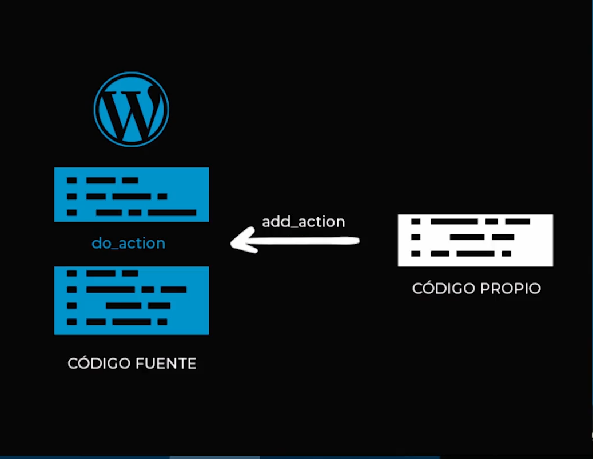
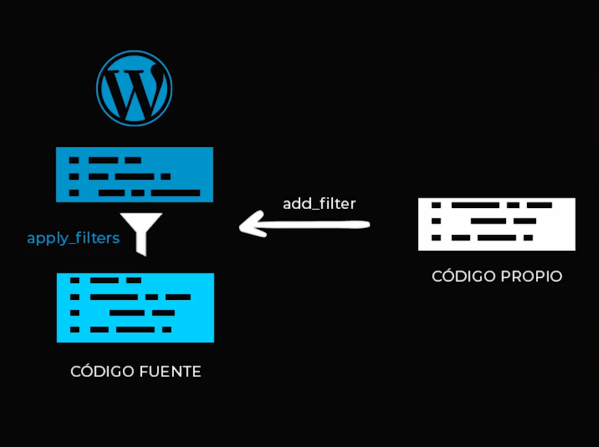

# Curso practico de Wordpress 

# 1. ¿Qué es Wordpress?
Es un sistema de gestión **CMS** (Content Management System). Desarrollado en **PHP** y adaptado para funcionar en entornos que utilizan los sistemas de gestión de bases de datos **MySql**. El mismo opera bajo **licencia GPL** y es de software libre.

## Inicios
Wordpress fue creado el 2003 por el programador estadounidense **Matt Mullenweg**, basándose en otra herramienta de software libre llamada **b2/cafelog**

## Wordpress.com vs Wordpress.org
Wordpress.com es un servicio online, en el no es necesario descargar nada, simplemente te registrar y podras crear un blog o web en sus servidores.
Wordpress.org aqui podemos descargar los archivos fuentes de **wordpress**, y instalarlo en nuestro servidor o entorno local.

# 2. Funcionamiento de wordpress.
WP funciona de la siguiente manera:
- Cúando alguien entra a nuestro sitio, wordpress ejecuta su código fuente.
- El código consulta a la base de datos que contenidos debe devolver y los procesa con los temas o template.
- Estos temas van a ocupar archivos para generar unas vistas.
- A la par, se van a ejecutar losp lugins.

## Principales caracteristicas.
- Autoadministrable: Permite administrar contenido y configuraciones sin usar código.
- Gestión de usuários: Permite crear usuários y segmentarlos por roles.
- API Rest: Permite generar operaciones mediante API rest.
- Flexible: Permite personalizar tanto su dieseño como sus funcionalidades.
- Actualizaciones: Está en constante crecimiento.
- Comunidad: Cuenta con una gran comunidad que aporta a su desarrollo.

# 3. ¿Qué son los temas en Wordpress?
## Theme
Son la estructura de archivos la cual va a generar las vistas en nuestro navegador. Estos archivos toman la información de la base de datos **MySql** y genera el código **HTML** que envía al navegador.

### Archivos Obligatorios de un theme

1. **index.php**: Archivo principal de nuestro theme y página de inicio. Todas las vistas que nosotros generemos van a tomar por defecto nuestro archivo index.php
2. **style.css**: Archivo principal de estilos y parametros de la plantilla.

### Otros archivos que vamos a utilizar 
1. **front-page.php**: Es la vista de carga por defecto, de la página principal.
2. **footer.php**: En este archivo indicaremos la información del pie de página.
3. **functions.php**: Es el archivo central de todas las funcionalidades de nuestro theme, basicamente amplia las funcionalidades del código fuente.
4. **header.php**: En este archivo se indica la información del encabezado.
5. **404.php**: En este archivo se indica la información que se mostrará cuando alguien ingrese a una URL de nuestro sitio que no exista.
6. **page.php**: Es la vista que carga por defecto páginas (vistas), cuando no se especifica una.
7. **screenshot.png**: Este archivo será nuestra imagen de muestra, en la seleccion de theme en el administrador.
8. **single.php**: Es la vista que carga por defecto entradas, post , etc, cuando no se especifica una.

# ¿Qué son los Hooks en Wordpress?
Son lugares dentro del código funete de WP en los cuales podemos agregar código propio o modificar datos que el mismo nos provee.
## Tipos de Hooks
1. **Action**: Nos permite ejecutar una función personalizada en un punto específico del código fuente de WP. funciona de la siguiente forma:
    - funciona con una funcion llamada **add_action** el cual va hacer referencia en algún lugar del código fuente de wordpress que va a estar marcado por un **do_action** y la va a ejecutar justo en ese lugar.
    
    ```php
    <?php 
    
    function holaMundo(){
        echo 'HOLA MUNDO';
    }

    add_action( 'wp_head', 'holaMundo' );
    // add_action( $hook, $functionName );
    ?>
    ```
2. **Filter**: Nos permiten ejectuar una función personalizada en un determinado punto, pero la función que usemos tendrá un parámetro de entrada, dentro de nuestra función heramos modificaciones al parámetro y finalmente lo retornaremos modificado. 
    - ejemplo: 
    ```php
    <?php 
    function upperTitle( $title ) return strtoupper( $title );
    add_filter('the_title', 'upperTitle')
    ?>
    ```